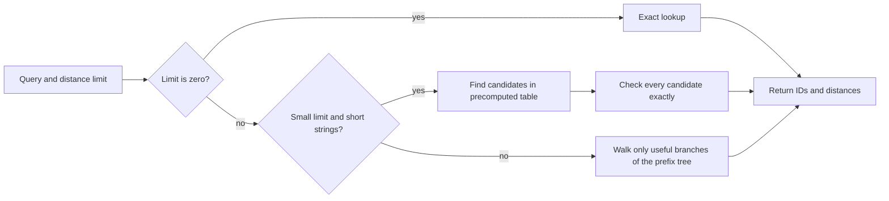

This PR adds exact bounded Levenshtein search for immutable string dictionaries while retaining the separate dense
`within(k)` primitive. It targets the common fuzzy-search contract where one dictionary is built once and queried
many times, returning every `(dictionary ID, distance)` match within an inclusive bound.

The implementation is an adaptive exact hybrid:

- `k = 0`: exact hash/radix lookup;
- `k = 1..2` on short strings: a symmetric deletion-neighborhood index followed by exact verification;
- larger bounds or long strings: radix-trie traversal with lazy banded-DP/automaton states.

In simpler terms, small distance limits use a precomputed lookup table to find a short list of possible matches. Every
possible match is checked before it is returned. Larger limits and longer strings use a compact prefix tree and only
visit branches that can still match. Both paths return the complete exact result. There are no false positives or
false negatives.

Closes [StringZilla #243](https://github.com/ashvardanian/StringZilla/issues/243).

#### Two different use cases

This PR improves two related but different operations:

- `within(k)` compares strings directly. It is useful when there is no reusable dictionary, or when every query must
  be compared with every candidate.
- `LevenshteinIndex` builds a dictionary once and reuses it for many queries. This is useful for spell checking,
  autocomplete, fuzzy lookup, entity matching, and search indexes.

The index does not replace the direct comparison code. The index work was added after the direct serial, AVX2, and
AVX-512 implementations were finished, and it does not change those code paths.

The new index:

- owns the dictionary and keeps duplicate entries with their original IDs;
- has separate byte and validated UTF-8 versions;
- measures Unicode distance by codepoint, not by encoded byte;
- can be shared by concurrent readers, with one reusable work buffer per reader;
- is available in C++, C, and Python.

#### How the engine is selected

The builder estimates how many deletion records a dictionary would need. It uses the lookup table only while that
growth is reasonable. It switches to the prefix tree before the table becomes too large. A word is never left out of
both paths.

#### How the benchmarks were checked

All indexed benchmarks answer the same question: for each query, return every dictionary entry whose plain
Levenshtein distance is at most `k`. Transpositions are disabled.

I used the following rules:

1. Pin tool versions, compiler flags, datasets, random seeds, and file hashes.
2. Give each implementation the same queries and dictionary.
3. Pin single-thread runs to one CPU. Use the same worker counts for parallel runs.
4. Include the cost of producing the results, not only finding candidate locations.
5. Report dictionary build time and memory separately from query time.
6. Run warm-cache and forced-cache-eviction tests separately.
7. Sort every StringZilla result and compare every `(ID, distance)` pair with RapidFuzz. Matching only the total count
   is not enough.

The main datasets were:

| Dataset | Dictionary | Queries | Why it is included |
|:---|---:|---:|:---|
| English words | 370,105 words | 10,000 | Normal short words |
| Wikipedia URLs | 97,054 strings | 10,000 | Longer strings |
| DNA | 100,000 strings of 100 bytes | 1,000 | Long strings with only four possible symbols |
| Simplified Chinese | 348,980 terms | 10,000 | Real Unicode and a very large number of matches |

The generated query sets contain equal numbers of exact words, one-edit changes, two-edit changes, and strings with
five added symbols. RapidFuzz, not the generator label, decides which dictionary entries actually match.

#### Main indexed result

The main English result used one pinned core on an AMD EPYC 4245P:

| Engine | `k=1` | `k=2` |
|:---|---:|---:|
| StringZilla | 1.948 ms | 41.555 ms |
| SymSpell-Rust | 20.931 ms | 455.857 ms |
| StringZilla speedup | 10.74x | 10.97x |

SymSpell normally computes a slightly different edit distance, changes words to lowercase, and does not preserve
duplicate dictionary IDs. The benchmark uses lowercase unique input and checks every SymSpell suggestion with plain
Levenshtein distance before comparing results. This makes the answers comparable, but it also means these numbers
include work required to adapt SymSpell's public API.

StringZilla used 34.4 MB for the `k=1` index and 134.0 MB for `k=2`, plus 6.46 MB for its copy of the dictionary.
Measured peak process memory was 86,516 KiB and 304,500 KiB. SymSpell peaked at 317,424 KiB and 812,100 KiB. Process
memory across C++ and Rust is not a perfect comparison, but the speedup was not bought by using more memory.

#### CPU coverage

The same source was compiled three ways on the AMD server:

| Compiler target on AMD Zen 4 | `k=1` | `k=2` |
|:---|---:|---:|
| portable x86-64 | 2.015 ms | 48.678 ms |
| Haswell/AVX2 | 1.920 ms | 42.115 ms |
| native AVX-512 | 1.948 ms | 41.555 ms |

These are three builds on one AMD machine, not three different CPUs. The index is mostly normal scalar code. AVX-512
did not provide a meaningful advantage, so this PR does not make an AVX-512-specific performance claim.

I also repeated the test on an independent Intel Core i5-9300H using explicit Haswell/AVX2 flags. The original server
query file was no longer available, so this test used a new deterministic 10,000-query set produced by the checked-in
generator. It is an independent repeat, not a direct CPU comparison.

| Engine on Intel AVX2 | `k=1` | `k=2` |
|:---|---:|---:|
| StringZilla | 8.274 ms | 88.167 ms |
| RapidFuzz full dictionary scan | 41.304 s | 69.228 s |
| StringZilla speedup | 4,992x | 785x |

StringZilla and RapidFuzz returned the same 12,053 and 144,160 matches. Their complete binary result files were
byte-for-byte identical at both limits.

#### Long strings and different alphabets

| Dataset | Engine selected at `k=1 / k=2` | StringZilla `k=1` | StringZilla `k=2` | Tantivy `k=1 / k=2` |
|:---|:---|---:|---:|---:|
| English | lookup table / lookup table | 1.95 ms | 41.6 ms | 485 ms / 4.183 s |
| Wikipedia URLs | lookup table / prefix tree | 15.9 ms | 502.6 ms | 480 ms / 2.428 s |
| DNA | prefix tree / prefix tree | 12.9 ms | 107.5 ms | 52.7 ms / 282.3 ms |

On the Simplified Chinese dictionary, StringZilla was 27.7x faster than SymSpell at `k=1` and 28.1x faster at `k=2`.
The `k=2` queries returned 343,237,926 matches. Producing that much output took StringZilla 5.149 seconds, so large
result sets are a real limit even when finding candidates is fast.

#### Build time and memory changes

An earlier version used a large array with many empty entries. The final version records which groups are present and
stores offsets only for groups that contain data.

| Limit | Earlier index | Final index | Final build time | Final peak process memory |
|---:|---:|---:|---:|---:|
| 1 | 149.3 MB | 34.4 MB | 0.235 s | 86,516 KiB |
| 2 | 211.2 MB | 134.0 MB | 1.324 s | 304,500 KiB |

Every hash match is still checked against the original word. Hash collisions can make a query do more work, but they
cannot change its answer.

#### Warm and cold cache results

The cold-cache test touches 256 MiB immediately before each query pass, outside the timer:

| Limit | StringZilla warm | StringZilla after eviction | SymSpell warm | SymSpell after eviction | Cold speedup |
|---:|---:|---:|---:|---:|---:|
| 1 | 1.948 ms | 4.309 ms | 21.026 ms | 29.215 ms | 6.78x |
| 2 | 41.555 ms | 45.867 ms | 465.391 ms | 471.992 ms | 10.29x |

The warm `k=1` result is above 10x, but the forced cold-cache result is 6.78x. This is why the PR describes the result
as order-of-magnitude performance on the main warm workload, not a 10x win in every situation.

#### Parallel queries

Each worker shares the index but has its own reusable work buffer:

| Workers | StringZilla `k=1` | SymSpell `k=1` | Speedup | StringZilla `k=2` | SymSpell `k=2` | Speedup |
|---:|---:|---:|---:|---:|---:|---:|
| 1 | 1.872 ms | 21.155 ms | 11.30x | 41.359 ms | 464.799 ms | 11.24x |
| 2 | 1.047 ms | 11.376 ms | 10.86x | 22.100 ms | 237.256 ms | 10.74x |
| 3 | 0.815 ms | 7.591 ms | 9.32x | 15.002 ms | 160.753 ms | 10.72x |
| 6 physical cores | 0.410 ms | 3.989 ms | 9.74x | 8.106 ms | 81.313 ms | 10.03x |
| 12 hardware threads | 0.261 ms | 3.049 ms | 11.67x | 5.762 ms | 55.986 ms | 9.72x |

The result stays close to 10x across the table, but some rows are below it and are shown as measured.

#### StringWars and direct `within(k)`

The first StringWars extension we wrote was not fair. It gave some tools different random strings, mixed byte and
text behavior, used different matrix sizes and CPU counts, and labelled cutoff distances as Boolean answers. Those
were mistakes in our new benchmark code, not problems in Ash's existing StringWars suite.

The corrected benchmark now:

- gives every tool the same deterministic inputs;
- tests mostly rejected, partly accepted, and mostly accepted inputs separately;
- checks each 512 by 512 result matrix against RapidFuzz before timing;
- uses the same matrix size and CPU count;
- labels results according to whether they include allocation, reuse an output buffer, return a distance, or return a
  Boolean answer.

The final server run checked 2,359,296 cells with zero mismatches. In matched one-CPU tests, StringZilla's direct
Boolean operation was 1.21x to 2.50x faster than RapidFuzz across `k=1`, `k=2`, and `k=4`.

The work is in [StringWars #9](https://github.com/ashvardanian/StringWars/pull/9) and commit
[`1f81925`](https://github.com/grouville/StringWars/commit/1f81925). These direct comparison results are separate
from the larger reusable-index results above.

#### Other tools

On the main AMD English workload:

| Tool | `k=1` speedup | `k=2` speedup | Important difference |
|:---|---:|---:|:---|
| Rust `fst` 0.4.7 | 445x | 132x | Returns IDs without distances |
| Tantivy 0.26.1 | 249x | 101x | Returns IDs without distances and stops at `k=2` |
| Lucene 10.3.1 exact automaton | 860x | 360x | Returns hit counts without distances |
| SymSpell-Rust | 10.74x | 10.97x | Adapted and checked to plain Levenshtein |

These tools do not expose exactly the same API, so the table states the important difference instead of presenting a
universal ranking.

#### Relation to previous work

The small-limit lookup follows the FastSS and symmetric-deletion family. The prefix-tree path follows the
Levenshtein automaton approach used in work by Schulz and Mihov, Lucene, and Rust `fst`. This PR combines those known
ideas and chooses between them based on the expected table size.

The new engineering work is the adaptive choice, compact lookup layout, packed records, exact hash checking, compact
prefix tree, cached distance states, reusable work buffers, duplicate-ID behavior, APIs, and the tests that show where
each choice wins or loses. I do not think performance measurements alone are enough to claim a new algorithmic paper.

#### Correctness checks

- 1,992,250 exhaustive small-string checks pass.
- Full English and Unicode result files match RapidFuzz byte-for-byte.
- Duplicate dictionary IDs are preserved.
- Invalid UTF-8 is rejected.
- Optimized and ASan/UBSan tests pass.
- Direct C API tests pass.
- Intel AVX2 compilation and tests pass.

#### What I think we can claim

I think the results support a state-of-the-art claim for the exact immutable-dictionary workloads measured here. We
are around an order of magnitude faster than the closest indexed baseline on the main English workload, and much
faster on several other datasets.

I do not think we should claim that StringZilla wins for every alphabet, string length, cache state, number of matches,
memory limit, or edit distance. The cold-cache and very large Chinese result set show real limits.

The remaining hardware check is Arm. The GitHub build and correctness jobs cover Arm, but a real Arm performance run
would make the final performance claim stronger. Intel AVX-512 is optional because this PR does not claim an AVX-512
advantage.
