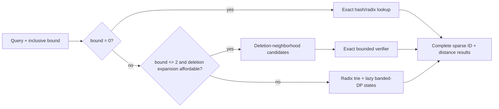

# Draft PR: Exact indexed Levenshtein retrieval

> Temporary working copy. Ratios and scope language are intentionally conservative; fold or trim this before opening
> the PR.

Closes [StringZilla #243](https://github.com/ashvardanian/StringZilla/issues/243).

## Summary

This PR adds exact bounded Levenshtein search for immutable string dictionaries while retaining the separate dense
`within(k)` primitive. It targets the common fuzzy-search contract where one dictionary is built once and queried
many times, returning every `(dictionary ID, distance)` match within an inclusive bound.

The implementation is an adaptive exact hybrid:

- `k = 0`: exact hash/radix lookup;
- `k = 1..2` on short strings: a symmetric deletion-neighborhood index followed by exact verification;
- larger bounds or long strings: radix-trie traversal with lazy banded-DP/automaton states.

The byte and validated UTF-8/codepoint contracts are separate. The index owns its dictionary, preserves duplicate
IDs, is immutable after construction, and supports concurrent readers through explicit reusable per-worker scratch.
C++, C, and Python APIs are included.

## Why an index belongs next to the dense primitive

Dense all-pairs distance and repeated immutable-dictionary retrieval are both useful, but they are different
contracts. StringWars remains the evidence for the former. The new benchmark harnesses measure the latter and must
not be described as a drop-in acceleration of a dense matrix.

The index does not replace or modify the finalized serial, Haswell/AVX2, or Ice Lake/AVX-512 dense kernels. All index
commits follow dense-kernel commit `39745be3` and touch separate index APIs, implementation, bindings, tests, and
benchmarks.

## Benchmark contract and methodology

All indexed comparisons answer the same logical question: for every query, return the complete set of dictionary
entries whose plain Levenshtein distance is at most `k`. Transpositions are disabled. Byte and Unicode-codepoint
semantics are never mixed. Timed results include query processing and output materialization, but exclude index
construction; build time and memory are reported separately.

The methodology uses the following gates:

1. Pin revisions, compiler flags, datasets, seeds, and input hashes.
2. Pin serial runs to one CPU; use identical deterministic striding and worker counts for parallel runs.
3. Warm reusable indexes before headline timing and report separate cache-eviction measurements.
4. Reuse explicit StringZilla scratch because that is the public API contract; retain required allocation/sorting
   costs in competitor public APIs and disclose the difference.
5. Materialize all results. Match counts are only a smoke check: final StringZilla streams are sorted and compared
   byte-for-byte with an independent RapidFuzz oracle.
6. Compare build latency, persistent index bytes, process peak, query latency, output density, and parallel scaling
   rather than optimizing a single number.

Primary pinned inputs:

| Corpus | Dictionary | Queries | Purpose |
|:---|---:|---:|:---|
| English words | 370,105; SHA-256 `3ed0c9...da48` | 10,000; SHA-256 `e5a10b...06fe` | Short natural ASCII; deletion-index headline |
| Wikipedia URLs | 97,054; SHA-256 `deb1ba...cc2` | 10,000; SHA-256 `a508d1...15c2` | Longer strings; hybrid boundary |
| four-symbol DNA | 100,000 x 100 bytes; SHA-256 `b0df69...4381` | 1,000; SHA-256 `ddd631...249d` | Long strings and tiny alphabet; trie path |
| Simplified Chinese | 348,980; SHA-256 `90b2ae...74a` | 10,000; SHA-256 `817800...abd` | Natural Unicode and dense output |

Mixed query sets use equal quarters of exact hits, one-edit mutations, two-edit mutations, and five-symbol length
extensions. Generator labels are not treated as truth: the full-dictionary oracle determines actual selectivity.

## Headline indexed-retrieval results

The primary English workload contains 370,105 dictionary words and 10,000 deterministic mixed queries. Every
StringZilla result was compared as a complete sorted `(ID, distance)` stream against pinned RapidFuzz, rather than
checking only aggregate match counts.

On one pinned AMD EPYC 4245P core:

| Engine | `k=1` | `k=2` |
|:---|---:|---:|
| StringZilla | 1.948 ms | 41.555 ms |
| SymSpell-Rust, contract-filtered | 20.931 ms | 455.857 ms |
| StringZilla speedup | 10.74x | 10.97x |

The final ranked directory uses 34.4 MB at `k=1` and 134.0 MB at `k=2`, plus 6.46 MB for the owned dictionary.
Isolated process peaks were 86,516 KiB and 304,500 KiB, below the measured SymSpell process peaks of 317,424 KiB
and 812,100 KiB. Runtime and API differences mean RSS is supporting evidence, not a serialized-size comparison.

The same source was compiled on that AMD host as portable x86-64, explicit Haswell/AVX2, and native AVX-512:

| Compile target on AMD Zen 4 | `k=1` | `k=2` |
|:---|---:|---:|
| portable x86-64 | 2.015 ms | 48.678 ms |
| Haswell/AVX2 | 1.920 ms | 42.115 ms |
| native AVX-512 | 1.948 ms | 41.555 ms |

These are three compiler targets on one machine, not three independent architecture measurements. The indexed hot
path is mostly scalar; the table supports an algorithmic rather than AVX-512-specific claim.

The adaptive choice also matters outside the short-English headline:

| Corpus | Selected plan at `k=1 / k=2` | StringZilla `k=1` | StringZilla `k=2` | Tantivy `k=1 / k=2` |
|:---|:---|---:|---:|---:|
| English | deletion / deletion | 1.95 ms | 41.6 ms | 485 ms / 4.183 s |
| Wikipedia URLs | deletion / trie | 15.9 ms | 502.6 ms | 480 ms / 2.428 s |
| DNA | trie / trie | 12.9 ms | 107.5 ms | 52.7 ms / 282.3 ms |

## Independent Intel AVX2 replication

An Intel Core i5-9300H (Coffee Lake, 4C/8T, 8 MiB L3) run used GCC 13.3, explicit
`-march=haswell -mtune=haswell`, and one pinned CPU. The public dictionary hash matched the AMD workload. The original
server query artifact was unavailable, so this run used a newly generated deterministic 10,000-query mixed set from
the checked-in generator, seed 243, SHA-256
`69a36c6f27e70fe548b664cb159fb519b472f199a66d430dbc2553a4abc819b9`.

| Engine | `k=1` | `k=2` |
|:---|---:|---:|
| StringZilla warm median | 8.274 ms (10 repeats) | 88.167 ms (7 repeats) |
| RapidFuzz cached scan | 41.304 s (3 repeats) | 69.228 s (3 repeats) |
| StringZilla speedup | 4,992x | 785x |

The runs returned 12,053 and 144,160 matches. Independently emitted StringZilla and RapidFuzz streams were
byte-identical, with SHA-256
`5f47ecede8837788287f20e2deb6b7567bacfd2617e76876ae34607bec171222` (`k=1`) and
`8af4d3b1d54ad6efb1945af718c813e81c487e05642da537411c82229936933f` (`k=2`). Laptop frequency and thermal state
were not controlled, so this is independent AVX2 confirmation, not an ISA comparison against the server.

## Construction, memory, cache, and concurrency

On English, the final ranked sparse directory replaced a dense 25-bit offset table:

| Bound | Dense directory | Ranked directory | Final build | Final isolated peak RSS |
|---:|---:|---:|---:|---:|
| 1 | 149.3 MB | 34.4 MB | 0.235 s | 86,516 KiB |
| 2 | 211.2 MB | 134.0 MB | 1.324 s | 304,500 KiB |

The representation stores one `(rank, 64-bit occupancy)` record per 64 hash buckets plus offsets only for occupied
buckets, and automatically keeps a dense directory when that is smaller. Dictionaries below `2^20` entries pack the
remaining hash suffix and dictionary ID into 32-bit records. Hash collisions can add verifier work but cannot change
results.

Touching 256 MiB outside the timer before each query pass gives an explicit cold-cache boundary:

| Bound | StringZilla warm | StringZilla evicted | SymSpell warm | SymSpell evicted | Evicted speedup |
|---:|---:|---:|---:|---:|---:|
| 1 | 1.948 ms | 4.309 ms | 21.026 ms | 29.215 ms | 6.78x |
| 2 | 41.555 ms | 45.867 ms | 465.391 ms | 471.992 ms | 10.29x |

The warm `k=1` headline therefore does not survive deliberate cache eviction at 10x; the lead remains substantial
but drops to 6.78x.

The immutable index shares storage across lock-free readers, with one scratch/result pair per worker:

| Workers | StringZilla `k=1` | SymSpell `k=1` | Speedup | StringZilla `k=2` | SymSpell `k=2` | Speedup |
|---:|---:|---:|---:|---:|---:|---:|
| 1 | 1.872 ms | 21.155 ms | 11.30x | 41.359 ms | 464.799 ms | 11.24x |
| 2 | 1.047 ms | 11.376 ms | 10.86x | 22.100 ms | 237.256 ms | 10.74x |
| 3 | 0.815 ms | 7.591 ms | 9.32x | 15.002 ms | 160.753 ms | 10.72x |
| 6 physical | 0.410 ms | 3.989 ms | 9.74x | 8.106 ms | 81.313 ms | 10.03x |
| 12 SMT | 0.261 ms | 3.049 ms | 11.67x | 5.762 ms | 55.986 ms | 9.72x |

This is order-of-magnitude class across the curve, but not above 10x in every cell.

## Dense `within(k)` / StringWars evidence

The corrected StringWars extension uses identical deterministic inputs, equal matrix shapes and CPU scope, and a
byte-level RapidFuzz oracle. On the 12-thread Zen 4 host it verified 2,359,296 cells with zero mismatches. At one CPU
with matched 16-by-16 matrices, StringZilla's allocation-inclusive Boolean engine was 1.21x to 2.50x faster than
RapidFuzz `process.cdist` across `k=1/2/4` and random/sparse/dense accept mixes. This supports the dense primitive on
its own contract; it is not the source of the larger indexed-retrieval ratios.

The corrected StringWars work is preserved at
[`grouville/StringWars@1f81925`](https://github.com/grouville/StringWars/commit/1f81925), with the complete change
against Ash's current base visible in the
[`main...levenshtein-within-k-bench` comparison](https://github.com/grouville/StringWars/compare/main...grouville:levenshtein-within-k-bench).
The dependent benchmark extension is open separately as
[`StringWars #9`](https://github.com/ashvardanian/StringWars/pull/9). Problems in the first experimental extension
were ours, not defects in Ash's existing suite.

## Other same-purpose baselines

On the AMD English workload, StringZilla measured:

- 445x/132x faster than Rust `fst` 0.4.7 at `k=1/2`;
- 249x/101x faster than Tantivy 0.26.1 at `k=1/2`;
- 860x/360x faster than Lucene 10.3.1's exact automaton-query mode at `k=1/2`;
- 10.74x/10.97x faster than contract-filtered SymSpell-Rust at `k=1/2`.

Those APIs do not all return distances, retain duplicates, or share memory/runtime models, so the benchmark report
states each contract rather than presenting the ratios as universal library rankings.

On a natural 348,980-term Simplified Chinese dictionary, StringZilla was 27.7x/28.1x faster than contract-filtered
SymSpell at `k=1/2`. Against RapidFuzz's full scan it was 1,344x faster at `k=1` and 6.98x at the extremely
dense-output `k=2` case, which materialized 343,237,926 matches. This is an explicit boundary on the low-bound
headline.

## Literature and design choices

This is an engineering combination of established families, not a claim that deletion neighborhoods or
Levenshtein automata were invented here:

- `k=1..2` follows the FastSS/symmetric-deletion family because candidate generation is cheaper than scanning short
  natural-language dictionaries at low bounds.
- Larger bounds and long strings follow trie/FST intersection with lazily evaluated banded DP, in the
  Schulz–Mihov/Lucene automaton family, because deletion-record expansion becomes combinatorial.
- The builder estimates complete deletion-neighborhood expansion and switches the whole relevant region to the trie;
  it never uses an incomplete index that could introduce false negatives.
- The ranked sparse directory, packed records, exact collision verifier, radix-compressed trie, lazy packed DP states,
  reusable scratch, duplicate-ID semantics, and measured adaptive boundary are the concrete implementation work.

The retained experimental history documents why a pure automaton and earlier directory layouts were not selected.
Performance alone does not establish a new literature result. A publishable algorithmic claim would still require an
explicit fitted cost model, more independent datasets and machines, and formal ablations of each representation.

## Correctness and safety

- Exhaustive small-alphabet tests cover 1,992,250 memberships.
- Full English and Unicode streams match RapidFuzz byte-for-byte.
- The deletion index stores residuals for deleting `0..k` symbols and always performs exact collision verification.
- Duplicate dictionary IDs are preserved.
- UTF-8 input is validated and edit distance is measured over decoded codepoints.
- Optimized and ASan/UBSan suites pass; LeakSanitizer is unavailable under the current ptrace environment.
- Direct C ABI tests pass.

## Claim boundary and remaining gate

The defensible claim is state-of-the-art-class exact retrieval for the measured immutable-dictionary workloads,
including an order-of-magnitude-class lead over the closest indexed baseline. It is not a universal claim over every
alphabet, length distribution, selectivity, memory budget, or edit bound.

Before submission:

- run compilation/correctness and preferably performance checks on Arm;
- decide whether to split the dense primitive, index core, bindings, and benchmark evidence into stacked review units;
- reduce this draft to the evidence Ash needs for review and link the full design report for details.

Intel AVX-512 is optional because this PR makes no AVX-512-specific performance claim. The deleted Zen 4 server does
not need to be re-rented: its raw logs, benchmark patch, compiler targets, and summarized results are preserved.
